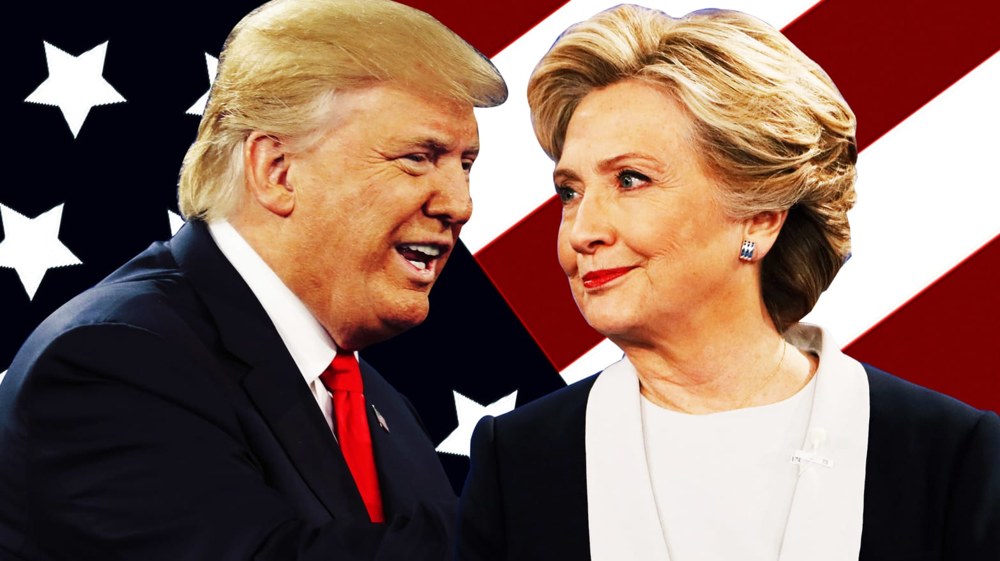
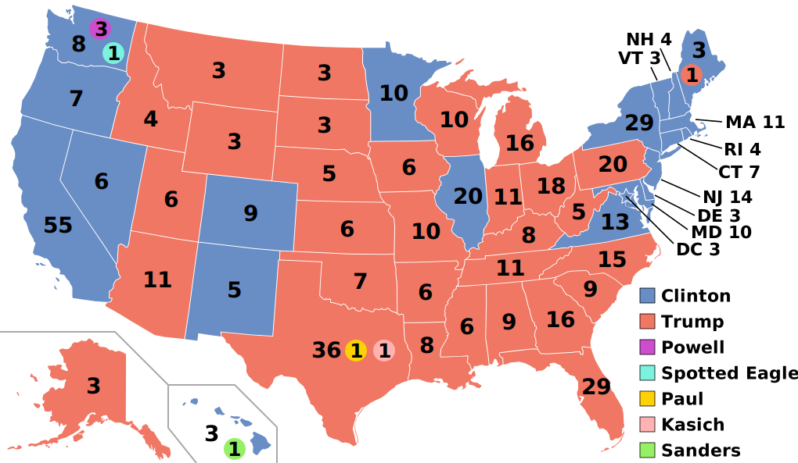

# 1. Introduction



In the remaining several months of 2020, the U.S. president election will be catching everyone's eyes. Voters in America will decide on 3 November whether Donald Trump remains in the White House for another four years. Speaking of President Trump, his victory over Hillary Clinton in the 2016 presidential election stunned many political observers and pollsters who expected Hillary to be the winner. In this blog, I would like to look deeper into the supporters for these two president candidates using the ANES 2016 Time Series data.

Before diving into details, let me summarize the questions I want to answer with the data:

* What are the characteristics of the interviewees that voted for Donald Trump?
    
    * What were different candidates' supporters' opinion on Obama, the previous president? 

    * What were their opinion on the U.S. economy since 2008?

    * What were their opinion on gay marriage? 

* Additionally: What does the data say about the 2016 presidential election result? Is it consistent with the actual result?


# 2. Basic information of the dataset


```{r load libraries, warning=FALSE, message=FALSE, include=FALSE}
library(tidyverse)
library(haven)
library(devtools)
library(RColorBrewer)
library(data.table)
library(ggplot2)
library(cowplot)
```

```{r include=FALSE}
load(file="../output/use_dat.RData")
```

The 2016 ANES Time Series Study contains `r nrow(use_dat)` cross-sectional cases. Pre-election interviews were conducted with study respondents during the two months prior to the 2016 elections and were followed by post-election interviewing beginning November 9, 2016. There were two modes of the study, face-to-face interviewing was complemented with data collection on the Internet, using substantially identical questionnaires. 

Among thousands of variables contained in the dataset, I select some of them for the analysis. The variables selected are, for example, 2016 presidential vote, state code, feeling thermometer and affect for Barack Obama, opinion on gay marriage. 


# 3. Analysis

## 3.1 What was Trump supporters' opinion on Barack Obama？

### 3.1.1 What was their affect for Obama?

According to the following chart, most interviewees who voted for Hillary Clinton showed positive attitude towards Obama. For example, most of them never or seldom felt angry about Obama, and about 80% of them felt proud of Obama more than half the time. However, those who voted for Donald Trump felt quite the opposite. More than 50% of them never felt proud of Obama. 

```{r echo=FALSE, fig.height=5, fig.width=10, warning=FALSE}
anes_vote_obama_angry <- use_dat %>%
  filter(vote_pres!="Refused"&vote_pres!="DK"&vote_pres!="INAP"&vote_pres!="Missing") %>%
  filter(affect_obama_angry!="Refused" & affect_obama_angry!="DK") %>%
  group_by(vote_pres, affect_obama_angry) %>%
  count(affect_obama_angry) %>%
  group_by(vote_pres) %>%
  mutate(prop = n/sum(n))

g1 <- ggplot(anes_vote_obama_angry,
       aes(x=vote_pres, y=prop, fill=affect_obama_angry)) +
  geom_bar(stat="identity", colour="black")+ 
  theme_bw()+
  scale_fill_brewer(palette="Blues")+
  theme(axis.text.x = element_text(angle = 20))+
  labs(title="Did voters feel angry about Obama?", fill="Angry about Obama")+
  xlab("President voted")+
  theme(plot.title = element_text(hjust = 0.5,size=12,face="bold"))

levels(use_dat$affect_obama_proud)[c(1,2)] <- c("Refused", "DK")
anes_vote_obama_proud <- use_dat %>%
  filter(vote_pres!="Refused"&vote_pres!="DK"&vote_pres!="INAP"&vote_pres!="Missing") %>%
  filter(affect_obama_proud!="Refused" & affect_obama_proud!="DK") %>%
  group_by(vote_pres, affect_obama_proud) %>%
  count(affect_obama_proud) %>%
  group_by(vote_pres) %>%
  mutate(prop = n/sum(n))

g2 <- ggplot(anes_vote_obama_proud,
       aes(x=vote_pres, y=prop, fill=affect_obama_proud)) +
  geom_bar(stat="identity", colour="black")+ 
  theme_bw()+
  scale_fill_brewer(palette="Blues")+
  theme(axis.text.x = element_text(angle = 20))+
  labs(title="Did voters feel proud of Obama?", fill="Proud of Obama")+
  xlab("President voted")+
  theme(plot.title = element_text(hjust = 0.5,size=12,face="bold"))

plot_grid(g1, g2, labels = "AUTO")
```


### 3.1.2 What were voters' feeling thermometer values for Obama?

Next, let's see how did voters feel about Obama.

```{r fig.width=6, fig.height=3, echo=FALSE}
anes_vote_obama_feeling <- use_dat %>%
  filter(vote_pres!="Refused"&vote_pres!="DK"&vote_pres!="INAP"&vote_pres!="Missing") %>%
  filter(feeling_obama>=0) %>%
  group_by(vote_pres) %>%
  mutate(feeling_obama = round(as.numeric(feeling_obama),0))
 
ggplot(anes_vote_obama_feeling,
       aes(x=vote_pres, y=feeling_obama, fill=vote_pres))+
  geom_boxplot()+
  guides(fill=FALSE)+
  stat_summary(fun.y=mean, geom="point", shape=5, size=2)+
  theme(axis.text.x = element_text(angle = 20))+
  labs(title="How did voters feel about Obama")+
  xlab("President voted")+
  ylab("Feeling for Obama")+
  theme(plot.title = element_text(hjust = 0.5,size=15,face="bold"))
```

Well, it's not surprisng to see the average feeling thermometer value for Obama in the first two groups were around 85 and 20 respectively, given the fact that most voters showed negative affact for Obama if they supported Donald Trump, and showed positive affect for Obama if they supported Hillary Clinton. However, one thing catches my attention. The feeling thermometer values for Obama in the first two groups were quite spread out. There were many outliers (exceeding $Q1-1.5*IQR$ or $Q3+1.5*IQR$) in the first two groups.


Let's separate the two modes of interviewers to see the feeling thermometer values.

```{r fig.width=8, fig.height=4, echo=FALSE}
anes_vote_obama_feeling_mode <- use_dat %>%
  filter(vote_pres!="Refused"&vote_pres!="DK"&vote_pres!="INAP"&vote_pres!="Missing") %>%
  filter(feeling_obama>=0) %>%
  group_by(vote_pres,mode) %>%
  mutate(feeling_obama = round(as.numeric(feeling_obama),0))
 
ggplot(anes_vote_obama_feeling_mode,
       aes(x=vote_pres, y=feeling_obama, fill=vote_pres))+
  geom_boxplot()+
  guides(fill=FALSE)+
  facet_wrap(~mode)+
  stat_summary(fun.y=mean, geom="point", shape=5, size=2)+
  theme(axis.text.x = element_text(angle = 20))+
  labs(title="How did voters feel about Obama")+
  xlab("President voted")+
  ylab("Feeling for Obama")+
  theme(plot.title = element_text(hjust = 0.5,size=15,face="bold"))
```

The pattern still holds. However, for Donald Trump voter group, more outliers in Web interview group than Face-to-Face group. It might be due to the fact that when doing questionnaire online, people lost patience and just entered number randomly. But fairly speaking, the wide-spread feeling thermometer values for Obama were actually reasonable. On one hand, he did bring the changes. The U.S. economy revives from aftermath of the Great Recession in his presidency; He expands Medicaid to uninsured low-income Americans. On the other hand, he didn't relieve the racial tensions, and people in different parties would hold different opinion on him. 


## 3.2 What were their opinion on the U.S. economy since 2008?

In the aspect of economy, let's see how Trump supporters think of the U.S. economy since 2008. 

```{r fig.width=6, fig.height=3, echo=FALSE}
anes_eco_08 <- use_dat %>%
  filter(vote_pres!="Refused"&vote_pres!="DK"&vote_pres!="INAP"&vote_pres!="Missing") %>%
  filter(eco_since08!="RF" & eco_since08!="DK") %>%
  group_by(vote_pres) %>%
  count(eco_since08) %>%
  mutate(prop=n/sum(n))
 
ggplot(anes_eco_08,
       aes(x=vote_pres, y=prop, fill=eco_since08)) +
  geom_bar(stat="identity", colour="black")+ 
  theme_bw()+
  scale_fill_brewer(palette="Blues")+
  theme(axis.text.x = element_text(angle = 20))+
  labs(title="How did voters think about the economy after 2008?", fill="Eco since 2008")+
  xlab("President voted")+
  theme(plot.title = element_text(hjust = 0.5,size=12,face="bold"))
```

From the chart we can see that Republican voters (i.e. who voted for Donald Trump) were not satisfied with the U.S. economy during Obama's presidency (i.e. since 2008). More than half of them thought the U.S. economy was worse than 2008 in 2016. 

So, how did Trump's supporters think of the importance of economy?


```{r fig.width=6, fig.height=4, echo=FALSE}
anes_most_imp <- use_dat %>%
  filter(vote_pres!="Refused"&vote_pres!="DK"&vote_pres!="INAP"&vote_pres!="Missing") %>%
  filter(most_imp!="NA") %>%
  group_by(most_imp) %>%
  count(vote_pres) %>%
  mutate(total=sum(n)) %>%
  mutate(prop=n/sum(n)) %>%
  arrange(desc(total)) %>%
  filter(vote_pres=="Donald Trump" | vote_pres=="Hillary Clinton") %>%
  ungroup() %>%
  mutate(rank=dense_rank(desc(total))) %>%
  filter(rank<=5)

ordered_prob <- unique(anes_most_imp$most_imp)
anes_most_imp_ordered = anes_most_imp %>% 
  mutate(most_imp2=factor(most_imp, levels=ordered_prob))

ggplot(anes_most_imp_ordered,
       aes(x=most_imp2, y=prop, fill=vote_pres))+
  geom_bar(position="dodge", stat="identity",colour="black")+
  theme_bw()+
  scale_fill_brewer(palette="Blues")+
  labs(title="Most important problem",fill="president voted")+
  xlab("")+
  theme(plot.title = element_text(hjust = 0.5,size=15,face="bold"))+
  theme(axis.text.x = element_text(angle = 20))
```

The bars above are ordered in the overall total number of votes, which means that among all interviewees most people thought the economy was the most important problem. And among those who think the economy was the most important proble, more than 60% of them are supporters of Trump.

```{r fig.width=8, fig.height=4, echo=FALSE}
anes_most_imp2 <- use_dat %>%
  filter(vote_pres=="Donald Trump" | vote_pres=="Hillary Clinton") %>%
  filter(most_imp!="NA") %>%
  group_by(vote_pres) %>%
  count(most_imp) %>%
  mutate(total=sum(n)) %>%
  mutate(prop=n/sum(n)) %>%
  top_n(5,prop) %>%
  arrange(desc(prop))

most_imp_hc <- anes_most_imp2 %>%
  filter(vote_pres=="Hillary Clinton")

most_imp_dt <- anes_most_imp2 %>%
  filter(vote_pres=="Donald Trump")

g3 <- ggplot(most_imp_hc,
       aes(x=most_imp, y=prop))+
  geom_bar(stat="identity", colour="black")+
  labs(title="Top-5 most important problem (Hillary's supporters)")+
  xlab("")+
  geom_text(aes(label=paste(round(prop,2))),angle=0,vjust=-0.2,position=position_dodge(0.9),size=3)+
  theme(axis.text.x = element_text(angle = 20))+
  theme(plot.title = element_text(hjust = 0.5,size=10,face="bold"))

g4 <- ggplot(most_imp_dt,
       aes(x=most_imp, y=prop))+
  geom_bar(stat="identity",colour="black")+
  labs(title="Top-5 most important problem (Trump's supporters)")+
  xlab("")+
  geom_text(aes(label=paste(round(prop,2))),angle=0,vjust=-0.2,position=position_dodge(0.9),size=3)+
  theme(axis.text.x = element_text(angle = 20))+
  theme(plot.title = element_text(hjust = 0.5,size=10,face="bold"))


plot_grid(g3, g4, labels = "AUTO")
```

If we separate the supporters of Hillary and Trump, we can see that the economy was the top-5 most important problem in both groups. But in Trump's group, 16% of the supporters cared much about the economy, surpassing the proportion of Hillary's group largely.

This is consistent with what I read in the [news](https://fivethirtyeight.com/features/voters-who-think-the-economy-is-the-countrys-biggest-problem-are-pretty-trumpy-that-might-not-help-him-much/), saying that Republican voters tend to put the economy first. It is because Republican voters were not satisfied with the economy and they viewed the economy as the top problem that they would like to vote Trump, a man with strong business background and slogan of "Make America Great Again". 


## 3.3 What were their opinion on gay marriage? 


```{r fig.width=10, fig.height=4, echo=FALSE}
anes_vote_gay <- use_dat %>%
  filter(vote_pres!="Refused"&vote_pres!="DK"&vote_pres!="INAP"&vote_pres!="Missing") %>%
  group_by(vote_pres, gay_marriage) %>%
  count(gay_marriage) %>%
  group_by(vote_pres) %>%
  mutate(prop=n/sum(n))

ggplot(anes_vote_gay,
       aes(x=vote_pres, y=prop, fill=gay_marriage))+
  geom_bar(stat="identity", colour="black")+
  labs(title="How did voters view gay marriage", fill="Gay marriage")+
  xlab("President voted")+
  theme(plot.title = element_text(hjust = 0.5,size=15,face="bold"))
```

It's not surprising that people who voted for Donald Trump were not proponent of gay marriage, after all the Republicans are conservative.

## 3.4 What does the data say about the 2016 presidential election result?

According to the post-election interview, we can summarize who did the voters vote in the 2016 election. 

### 3.4.1 Who was voted more, Hillary Clinton or Donald Trump?

```{r fig.width=6, fig.height=3, echo=FALSE}
## seems that Hillary had more supporters than Trump according to the time series data
anes_vote <- use_dat %>%
  filter(vote_pres!="Refused"&vote_pres!="DK"&vote_pres!="INAP"&vote_pres!="Missing") %>%
  select(vote_pres)
  
ggplot(anes_vote,
       aes(x=vote_pres))+
  geom_bar(stat="count",colour="black")+
  theme_bw()+
  scale_fill_brewer(palette="Blues")+
  labs(title="Who did American vote in 2016")+
  xlab("President voted")+
  theme(plot.title = element_text(hjust = 0.5,size=15,face="bold"))
```


The histogram tells us that Hillary Clinton won more votes than Donald Trump.

### 3.4.2 Was the survey data consistent with the actual result?

It is known to all that the election of the president is an indirect election, in which citizens of the U.S. who are registered to vote in one of the 50 U.S. states or in Washingtong D.C., cast balllots not directly for those offices, but instead for members of the Electoral College. These electors then cast direct votes, known as electoral votes, for president.

Typically, state laws establish a winner-take-all system, wherein the ticket that wins a plurality of votes wins all of that state's allocated electoral votes. Different states have different number of electoral votes due to the population difference. 

So, where did those interviewees come from?

```{r fig.width=12, fig.height=6, echo=FALSE}
anes_vote_state <- use_dat %>%
  filter(vote_pres!="Refused"&vote_pres!="DK"&vote_pres!="INAP"&vote_pres!="Missing") %>%
  group_by(state,vote_pres) %>%
  count(vote_pres) %>%
  group_by(state) %>%
  mutate(prop=n/sum(n)) %>%
  filter(vote_pres=='Hillary Clinton' | vote_pres=='Donald Trump') %>%
  arrange(vote_pres, desc(prop))

ordered_state <- unique(anes_vote_state$state)
df = anes_vote_state %>% 
  mutate(state2=factor(state, levels=ordered_state))


ggplot(df,
       aes(x=state2, y=prop))+
  geom_bar(stat="identity", colour="white", aes(fill=vote_pres), position="dodge", width=0.8)+
  guides(fill = guide_legend(reverse = TRUE)) +
  labs(fill="president voted")+
  xlab("State")+
  theme(axis.title.x = element_text(size=20))+
  scale_fill_manual(values = c("#00188F","#00BCF2"),
                    labels = c("Hillary Clinton","Donald Trump"))+
  geom_hline(aes(yintercept=0.5), color="purple", linetype="dashed")+
  annotate("text",x=20,y=0.53,label='PA',size=5)+
  annotate("text",x=16,y=0.56,label='WI',size=5)+
  annotate("text",x=23,y=0.505,label='CT',size=5)+
  coord_flip()
```

According to the barplot, we can see that in Wisconsin and Pennsylvania, Hillary won more votes than Trump, and had the same proportion of support as Trump in Connecticut.

However, in the 2016 Electoral College map (the actual result), we can see that Hillary didn't get the electoral votes in Wisconsin and Pennsylvania, but did get the electoral votes in Connecticut. 




Well, that is the discrepancy between survey sample and the reality. We should be aware of the error coming from sample. The error might be due to response or non-response biases. For example, by looking at the number of respondents from each state, we notice that there was only one respondent from Alaska, which would definitely cause bias. Apart from the number of samples in the survey, how the samples are consituted are also important. For example, in order to have representative samples, one should consider stratified sampling method.


```{r echo=FALSE}
anes_vote_state2 <- use_dat %>%
  filter(vote_pres!="Refused"&vote_pres!="DK"&vote_pres!="INAP"&vote_pres!="Missing") %>%
  group_by(state) %>%
  count() %>%
  arrange(n)
head(anes_vote_state2)
```


#### Other limitation of the survey data?

As is shown previously, voters for Trump were not proponent of gay marriage. However, the proportion of the opinion "There should be no legal recognition of a gay or lesbian couple's relationship" is higher in the Web group than the Face-to-Face group. It might be due to the fact that people are shy if interviewed by another person and may give the answer that is modified. 

```{r fig.width=10, fig.height=5, echo=FALSE}
anes_vote_gay <- use_dat %>%
  filter(vote_pres!="Refused"&vote_pres!="DK"&vote_pres!="INAP"&vote_pres!="Missing") %>%
  group_by(vote_pres, gay_marriage, mode) %>%
  count(gay_marriage) %>%
  group_by(vote_pres, mode) %>%
  mutate(prop=n/sum(n))


ggplot(anes_vote_gay,
       aes(x=vote_pres, y=prop, fill=gay_marriage))+
  geom_bar(stat="identity", colour="black")+
  facet_wrap(~mode, ncol=1)+
  labs(title="How did voters view gay marriage",fill="Gay marriage")+
  xlab("President voted")+
  theme(plot.title = element_text(hjust = 0.5,size=15,face="bold"))+
  coord_fixed(ratio=2)

```

# 4. Summary

Based on the analysis of 2016 election survey data, three aspects of the characteristics of Trump voters are well summarized. Namely, they were not fans of Barack Obama, they were not satisfied with the U.S. economy during Obama's presidency and they prioritized the U.S. economy, they were not proponent of gay marriage (rather conservative).

Moreover, the survey data statistics concerning state-wise voting proportion is not consistent with the fact, which reminds us of the limitation of survey data. Survey is useful for us to know what is happening and how people are thinking. However, we should be careful when analyzing or drawing conclusion of the survey data due to response or non-response biases.


# 5. Reference

https://www.thedailybeast.com/donald-trump-goes-full-rage-monster-on-hillary-and-bill-clinton

https://en.wikipedia.org/wiki/United_States_presidential_election

https://commons.wikimedia.org/wiki/File:ElectoralCollege2016.svg

https://www.washingtonpost.com/lifestyle/kidspost/donald-trump-is-elected-president-of-the-united-states/2016/11/09/58046db4-a684-11e6-ba59-a7d93165c6d4_story.html

https://fivethirtyeight.com/features/voters-who-think-the-economy-is-the-countrys-biggest-problem-are-pretty-trumpy-that-might-not-help-him-much/


